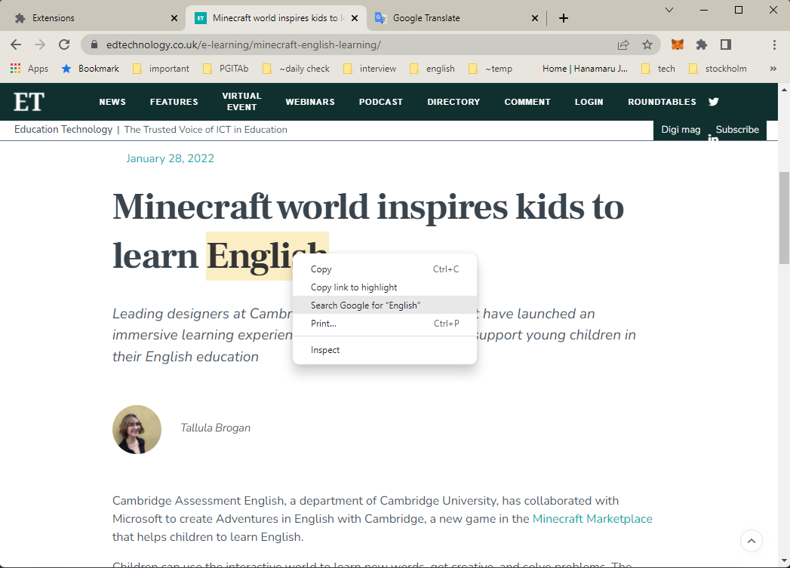
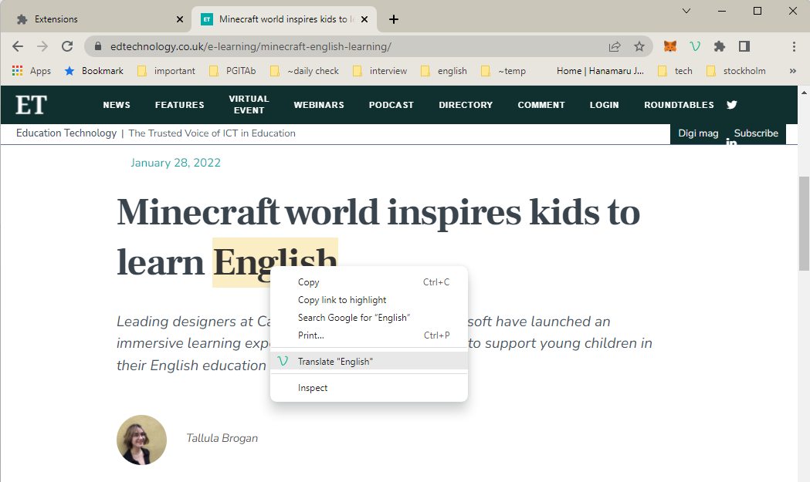
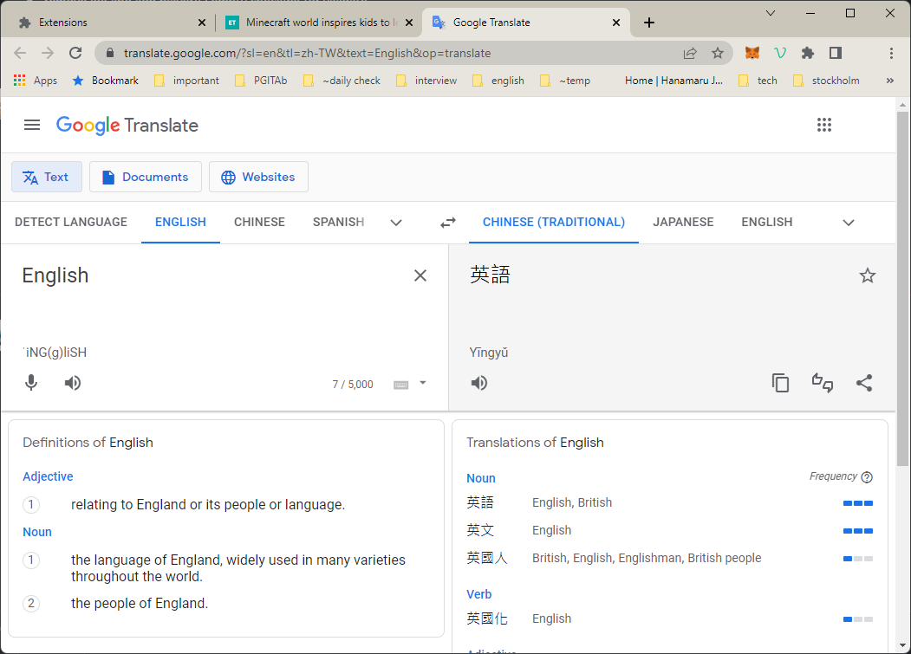

# vocabulary-revision-lite
Store the words with urls for your further revision

## Background
I want to translate the highlighted text but the current "Right click on highlighted text" only brings the search result.

I would like to add "Translate w/Revision" function to the context menu and so I write this simple extension.

## Install
1. You can download from [google web store](https://chrome.google.com/webstore/detail/vocabulary-revision-lite/llcbnmbbomnpbhcapnlgcelpbammmjmd).
2. You can also [install from source](manual/installation/GUIDE.md).

## How to use
1. Right click the highlighted text and click Translate.

2. Google translate automatically runs.

3. You can review your vocabulary list. You can also delete any vocabulary or export the vocabulary list.

## Goal
1. Shortcut for searching the highlight text
2. Backend for storing data
3. Using lodash.cloneDeep instead of JSON.parse(JSON.stringify(obj))
4. Pagination
5. Put all languages supported by google translate into the "Translate from/to" drop down
6. Testing

## Reference
1. [Icon](https://www.iconfinder.com/icons/5437092/media_social_v_vent_icon)

## Documentation 
[Click here](manual/documentation/DOCUMENTATION.md)

## Feedback
I would be grateful for any feedback.
1. email [pakyinw@hotmail.com](mailto:pakyinw@hotmail.com)
2. create an issue
3. create pull request
 