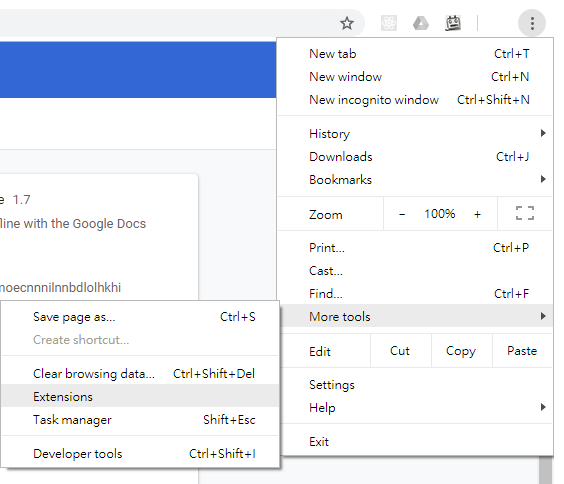
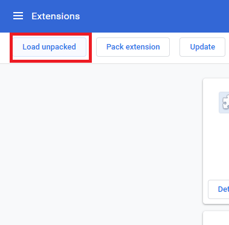

# How to run from source

## Install from source
1. Clone or download this repository
```
git clone https://www.github.com/pakyinw/vocabulary-revision-lite.git
```

2. Build from the source
```
cd vocabulary-revision-lite
npm i
npm run build
```

3. Click the top right corner's "Extension" in Chrome.



4. Click the top left corner's "Load Unpacked" in Chrome.



5. Choose the ./build folder from vocabulary-revision-lite.