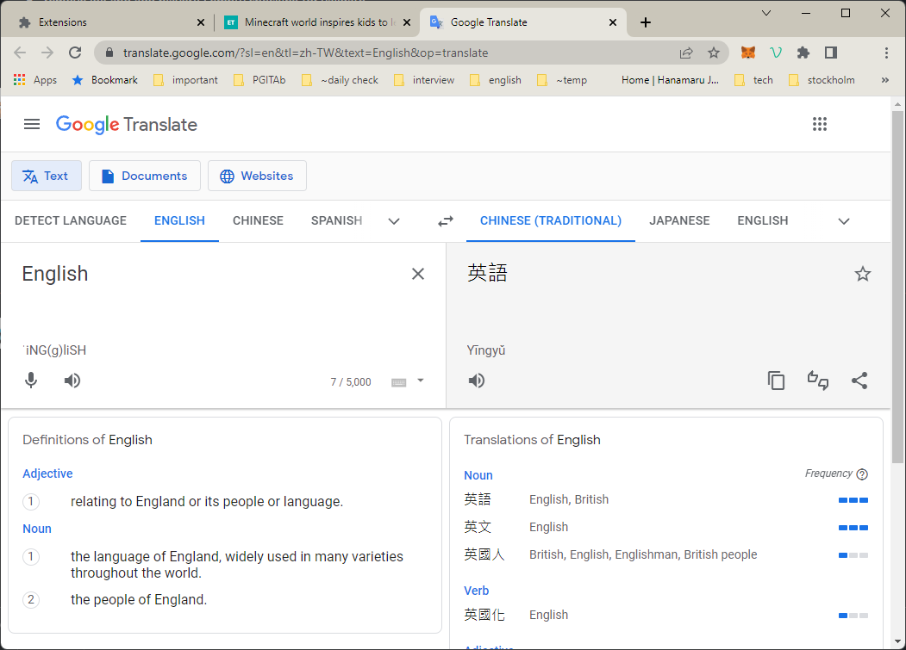
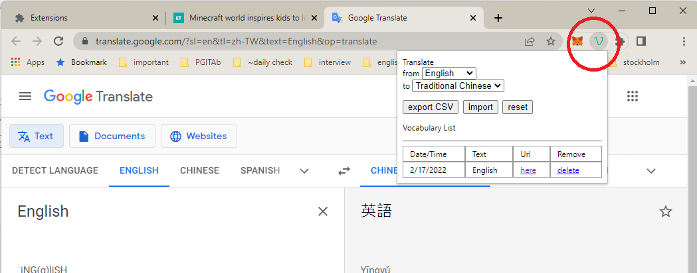

# How to use
1. Right click the highlighted text and click Translate.

2. Google translate automatically runs.

3. You can review your vocabulary list. You can also delete any vocabulary or export the vocabulary list.

